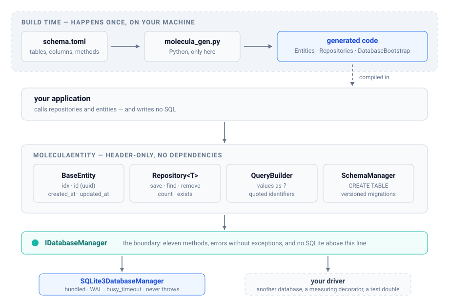

<p align="center">
  <picture>
    <source media="(prefers-color-scheme: dark)" srcset="assets/logo-dark.svg">
    
  </picture>
</p>

<p align="center">
  Entity/Repository for <strong>C++17 and SQLite</strong>, with a code generator driven
  by a declarative schema.<br>
  You describe the tables in TOML; it generates the entities, the repositories and the
  migrations — and your code stops writing SQL.
</p>

<p align="center">
  <a href="https://github.com/marcosdxt/MoleculaEntity/actions/workflows/ci.yml"></a>
  <a href="https://en.cppreference.com/w/cpp/17"></a>
  <a href="LICENSE"></a>
</p>

```cpp
#include <MoleculaEntity/SQLite3DatabaseManager.hpp>
#include "generated/Entities.hpp"

auto db = MoleculaEntity::SQLite3DatabaseManager::open("app.db");   // never throws
if (!db) { /* handle it */ }

MyApp::DatabaseBootstrap bootstrap(db);
if (!bootstrap.syncAll()) {                  // creates tables, applies migrations
    std::fprintf(stderr, "schema: %s\n", bootstrap.lastError().c_str());
    return 1;
}

MyApp::UserRepository users(db);

MyApp::UserEntity user;
user.setName("Ada");
user.setEmail("ada@example.com");
user = users.save(user);                     // INSERT, uuid and timestamps

if (auto found = users.findByEmail("ada@example.com")) {
    std::printf("%s, created at %s\n",
                found->getName().c_str(),
                MoleculaEntity::time_utils::formatUtc(*found->getCreatedAt()).c_str());
}
```

## What it is, and what it isn't

**It is** a thin layer over SQL, header-only, for people who embed SQLite in an
application and would rather not scatter `sqlite3_prepare_v2` across the code.
Entities with a double identity (an integer `idx` and a uuid `id`), generic CRUD,
a typed query builder, migrations versioned per table, and a generator that turns
a schema into code.

**It isn't** an ORM with relationship mapping, lazy loading, an identity map or
multiple dialects. There is no `JOIN` in the query builder — when you need one,
write the SQL and use `IDatabaseManager::query`, which is right there for that.

Dependencies: none for the library; SQLite3 for the bundled driver; Python 3.11+
(or 3.7+ with `tomli`) for the generator, and **only when generating** — the
generated code doesn't depend on Python.

## Architecture

<p align="center">
  <picture>
    <source media="(prefers-color-scheme: dark)" srcset="assets/architecture-dark.svg">
    
  </picture>
</p>

Two boundaries explain the whole design:

**The generator runs at build time, and then it's gone.** It's Python, it reads
`schema.toml` and writes C++. Nothing it produces depends on Python at runtime,
and the final binary has no idea it ever existed.

**`IDatabaseManager` is where SQLite enters — and it's the only place.** Above
that line there is no `sqlite3.h` at all: entities, repositories and the query
builder talk to the interface. That's why swapping the database, or wrapping the
driver to measure every query, is one class and no change to anything else
([example 06](examples/06-custom-driver/main.cpp)).

## Getting started

### As a dependency (recommended)

```cmake
include(FetchContent)
FetchContent_Declare(MoleculaEntity
    GIT_REPOSITORY https://github.com/marcosdxt/MoleculaEntity.git
    GIT_TAG v0.1.0)
FetchContent_MakeAvailable(MoleculaEntity)

target_link_libraries(your_app PRIVATE MoleculaEntity::SQLite3)
```

Two targets, and the choice is explicit:

| Target | What it brings |
|---|---|
| `MoleculaEntity::MoleculaEntity` | the headers only, **with no dependency at all** — for anyone implementing `IDatabaseManager` over another database |
| `MoleculaEntity::SQLite3` | the above plus the bundled SQLite driver (links `SQLite::SQLite3`) |

### Installed system-wide

```sh
cmake -S . -B build -DMOLECULA_BUILD_TESTS=OFF
cmake --build build --target install
```

```cmake
find_package(MoleculaEntity REQUIRED)
target_link_libraries(your_app PRIVATE MoleculaEntity::SQLite3)
```

### Building and testing the project itself

```sh
git clone https://github.com/marcosdxt/MoleculaEntity.git
cd MoleculaEntity
cmake -S . -B build
cmake --build build
ctest --test-dir build --output-on-failure
```

You don't have to install GoogleTest or run the generator by hand: CMake uses the
system GoogleTest when it's there, downloads it when it isn't, and invokes the
generator during the build.

## The three steps

### 1. Describe the schema

```toml
# schema.toml
[config]
namespace = "MyApp"
output_dir = "generated"

[entities.User]
table = "users"
version = 1

[entities.User.columns]
name  = { type = "string", nullable = false }
email = { type = "string", nullable = false, unique = true }
age   = { type = "int",    nullable = true }

[entities.User.repository]
findByEmail = { where = [{ column = "email", op = "eq" }], returns = "optional" }
```

### 2. Generate

```sh
python3 generator/molecula_gen.py schema.toml -o generated
```

Or, better, from your CMake — that way the generated code is never stale:

```cmake
add_custom_command(
    OUTPUT ${CMAKE_CURRENT_BINARY_DIR}/generated/Entities.hpp
    COMMAND Python3::Interpreter ${CMAKE_SOURCE_DIR}/generator/molecula_gen.py
            ${CMAKE_SOURCE_DIR}/schema.toml -o ${CMAKE_CURRENT_BINARY_DIR}/generated
    DEPENDS ${CMAKE_SOURCE_DIR}/schema.toml
    VERBATIM)
```

**Generated code doesn't belong in version control.** It derives from the schema
the way a `.o` derives from a `.cpp` — committing both guarantees that one day
they'll disagree.

### 3. Use it

The snippet at the top of this page is step 3, in full.

### Six examples that actually run

The [`examples/`](examples/) directory goes from the basics to what you'll need in
production — and **every one of them is executed by `ctest`**, so none of them
rots quietly:

| | | |
|---|---|---|
| [01](examples/01-basics/main.cpp) | basics | entity and repository by hand, full CRUD |
| [02](examples/02-generator/) | generator | the same domain, in 20 lines of TOML |
| [03](examples/03-queries/) | queries | the whole `QueryBuilder`, and where it ends |
| [04](examples/04-migrations/main.cpp) | migrations | the database already in the field, with data in it |
| [05](examples/05-errors-and-transactions/main.cpp) | production | errors without exceptions, transactions, driver options |
| [06](examples/06-custom-driver/main.cpp) | extension | your own `IDatabaseManager`, measuring SQL |

```sh
ctest --test-dir build -R example --output-on-failure
```

## The contracts

What the library promises, and what's worth knowing before you trust it.

### Database errors don't become exceptions

A SQL failure — opening, preparing, binding a parameter, executing — becomes
`false` (or an empty result), and the reason lands in `lastError()`:

```cpp
if (!db->execute("INSERT INTO ...", params)) {
    log(db->lastError());
}

const auto rows = db->query("SELECT ...");
if (!db->ok()) { /* it failed */ }
else if (rows.empty()) { /* it ran, and found nothing */ }
```

`ok()` exists because a query that fails and a query with no results are both an
empty vector. Without it, there is no way to tell "nothing there" from "it didn't
run".

This is **not `noexcept`**, and the difference matters: these methods build
`std::string` and `std::vector`, so they can throw `std::bad_alloc` under memory
pressure, like any C++ code that allocates. What's promised is narrower and more
useful: **the database is not a source of exceptions** — no `sqlite3_*` error
reaches the caller as a `throw`.

`BaseRepository::save()` and `update()` **do throw** `std::runtime_error` when a
write fails — that's the exception to the rule, flagged here because anyone
running inside a service that can't unwind the stack needs to know.

### Schema: the return value is not optional

`initialize()`, `syncEntity<T>()`, `dropTable<T>()` and the generated `syncAll()`
return `bool`, and the return is `[[nodiscard]]`:

```cpp
SchemaManager schema(db);
if (!schema.initialize() || !schema.syncEntity<Order>()) {
    log(schema.lastError());
    return;
}
```

The signature is part of the guarantee. A migration that fails is **not
recorded**, and is rolled back whole — including earlier steps of the same run,
because it all runs in one transaction and SQLite rolls back DDL. The next
startup tries again.

Two more things that fail loudly instead of slipping by:

- **A declared version with no migration that reaches it.** Before, `version = 3`
  without migration 3 did nothing and reported success; the schema silently
  stayed behind. Today that's an error, and the message names the gap.
- **A parameter count that doesn't match the number of `?`.** To SQLite, a `?`
  nobody bound is `NULL` — an `UPDATE` would quietly become "clear the column".
  Today the statement is refused before it runs.

### Time is UTC

`created_at` and `updated_at` are filled by SQLite's `CURRENT_TIMESTAMP`, which
writes **UTC**, and they are read back as UTC. No conversion here ever consults
the machine's timezone. To display, convert yourself — and to compare or write a
timestamp by hand:

```cpp
MoleculaEntity::time_utils::formatUtc(tp);   // "2026-09-16 23:14:11"
MoleculaEntity::time_utils::parseUtc(text);  // std::optional<time_point>
```

The suite runs in `America/Sao_Paulo` and `Asia/Tokyo` on CI, on top of UTC. That
isn't zeal: an earlier version read the timestamp with `std::mktime`, shifted
everything by the local offset, and went green on every CI in the world — because
CI runs in UTC.

### Identifiers are quoted

Values always travel as `?`. Table and column names can't travel as `?` — no
database accepts that — so they go **quoted**, with escaping:

```cpp
qb.where("order", CompareOp::Equals, v);   //  WHERE "order" = ?
```

Two consequences: a column named after a reserved word (`order`, `group`) works,
and a column name arriving from outside can't escape into the SQL. The driver
also turns off SQLite's `DQS` (`SQLITE_DBCONFIG_DQS_DML`); otherwise a
non-existent identifier would silently become a *string* instead of an error.

### Thread safety

| | |
|---|---|
| `UuidGenerator::generate()` | **safe** across threads (one engine per thread) |
| `QueryBuilder`, entities | safe as long as each thread has its own instance |
| `SQLite3DatabaseManager` | **one connection per thread.** Sharing one requires serializing around it |
| `BaseRepository` | follows the connection it was given |

### What the driver turns on by default

```cpp
SQLite3DatabaseManager::Options options;
options.walJournal = true;                        // readers don't block the writer
options.busyTimeout = std::chrono::seconds(5);    // SQLite's default is ZERO
options.synchronous = Options::Synchronous::Full; // survives a power cut
options.foreignKeys = true;                       // SQLite's default is off
options.strictIdentifiers = true;                 // "text" doesn't silently become a string

auto db = SQLite3DatabaseManager::open("app.db", options, &error);
```

The defaults are those of a service that writes to a real disk. In tests,
`:memory:` ignores WAL, and `synchronous` can drop to `Off` if the suite is large.

## Reference

### Base columns

Every entity is born with four columns, and you don't declare them in the schema:

| Column | Type | What for |
|---|---|---|
| `idx` | `INTEGER PRIMARY KEY AUTOINCREMENT` | the database key — cheap for indexes and foreign keys |
| `id` | `TEXT UNIQUE` | uuid v4, generated on `save()` — the identity that crosses processes and machines |
| `created_at` | `TIMESTAMP` | `CURRENT_TIMESTAMP` (UTC) |
| `updated_at` | `TIMESTAMP` | kept by a trigger on every UPDATE (UTC) |

Two identities on purpose: `idx` is fast and local to the file; `id` is stable and
can be matched across systems. Whoever syncs with another service uses `id`;
whoever links tables uses `idx`.

### QueryBuilder

```cpp
QueryBuilder qb;
qb.where("active", CompareOp::Equals, int64_t{1})
  .andWhere("age", CompareOp::GreaterThan, int64_t{18})
  .orWhere("role", CompareOp::Equals, std::string{"admin"})
  .whereIn("status", {std::string{"new"}, std::string{"paid"}})
  .whereBetween("created_at", a, b)
  .whereNull("deleted_at")
  .orderBy("name", OrderDirection::Asc)
  .limit(20)
  .offset(40);
```

| Method | SQL |
|---|---|
| `where` / `andWhere` / `orWhere` | `= ?`, `!= ?`, `> ?`, `>= ?`, `< ?`, `<= ?`, `LIKE ?`, `NOT LIKE ?` |
| `whereIn` / `whereNotIn` | `IN (?, ?, …)` |
| `whereBetween` | `BETWEEN ? AND ?` |
| `whereNull` / `whereNotNull` | `IS NULL` / `IS NOT NULL` |
| `orderBy`, `limit`, `offset` | `ORDER BY`, `LIMIT`, `OFFSET` |

> **There are no parentheses around `AND` and `OR`.** Conditions are chained in
> the order you add them, with SQL's precedence — `A AND B OR C` is
> `(A AND B) OR C`. To group differently, write the SQL.

### BaseRepository

| | |
|---|---|
| `save(e)` | INSERT when new, UPDATE when already persisted. Generates the uuid when missing |
| `update(e)` | UPDATE; throws if the entity was never persisted |
| `remove(e)` / `removeById(idx)` / `removeByUuid(id)` | DELETE |
| `findOne(idx)` / `findByUuid(id)` | `std::optional<Entity>` |
| `find(qb)` / `findAll()` | `std::vector<Entity>` |
| `count(qb)` / `exists(qb)` / `existsById` / `existsByUuid` | counting and existence |

The methods the generator creates from `[entities.Name.repository]` sit alongside
these, with the name and signature you chose.

### SchemaManager and migrations

```cpp
MoleculaEntity::SchemaManager schema(db);
if (!schema.initialize()) { /* schema.lastError() */ }   // creates __schema_migrations
if (!schema.syncEntity<UserEntity>()) { /* ... */ }      // CREATE TABLE + trigger + index
```

The applied version of each table lives in `__schema_migrations`. Raise the
entity's `version`, declare the migration, and `syncEntity` applies what's missing
— **inside a transaction**, rolling back if anything fails along the way, and
recording nothing when it does.

```toml
[entities.User]
version = 2

[entities.User.migrations]
2 = { description = "phone", up = "ALTER TABLE users ADD COLUMN phone TEXT" }
```

### The TOML schema, field by field

#### Overall shape

```
schema.toml
│
├── [config]                  # global settings
│
└── [entities.EntityName]     # one block per entity
    ├── table = "table_name"
    ├── version = N
    ├── [entities.Name.columns]
    ├── [entities.Name.indexes]
    ├── [entities.Name.repository]
    └── [entities.Name.migrations]
```

#### `[config]`

```toml
[config]
namespace = "MyApp"              # C++ namespace for the generated code
output_dir = "generated"         # output directory
include_guard_prefix = "MYAPP"   # prefix for include guards (optional)
```

| Field | Type | Required | Description |
|---|---|---|---|
| `namespace` | string | no | C++ namespace (default: `Generated`) |
| `output_dir` | string | no | output directory (default: `generated`) |
| `include_guard_prefix` | string | no | guard prefix (default: `GENERATED`) |

#### `[entities.Name]`

```toml
[entities.User]
table = "users"    # table name in the database
version = 1        # schema version, for migrations
```

| Field | Type | Required | Description |
|---|---|---|---|
| `table` | string | yes | table name in the database |
| `version` | int | yes | current schema version |

#### `[entities.Name.columns]`

The entity's own columns — on top of the four base columns, which are automatic.

```toml
[entities.User.columns]
name = { type = "string", nullable = false }
email = { type = "string", nullable = false, unique = true }
age = { type = "int", nullable = true }
salary = { type = "double", nullable = true }
active = { type = "bool", nullable = false, default = "true" }
created_by = { type = "int64", nullable = false, foreign_key = { table = "admins", column = "idx" } }
```

##### Supported types

| TOML type | C++ type | SQLite type |
|---|---|---|
| `string` | `std::string` | `TEXT` |
| `int` | `int` | `INTEGER` |
| `int32` | `int32_t` | `INTEGER` |
| `int64` | `int64_t` | `INTEGER` |
| `double` | `double` | `REAL` |
| `float` | `float` | `REAL` |
| `bool` | `bool` | `INTEGER` |
| `blob` | `std::vector<uint8_t>` | `BLOB` |
| `timestamp` | `BaseEntity::Timestamp` | `TIMESTAMP` |

##### Column properties

| Property | Type | Default | Description |
|---|---|---|---|
| `type` | string | — | column type (required) |
| `nullable` | bool | `true` | allows NULL |
| `unique` | bool | `false` | unique value |
| `default` | string | — | SQL default |
| `foreign_key` | object | — | foreign key |

##### Foreign key

```toml
user_id = {
    type = "int64",
    nullable = false,
    foreign_key = { table = "users", column = "idx" }
}
```

#### `[entities.Name.indexes]`

```toml
[entities.User.indexes]
email_idx = { columns = ["email"], unique = true }
name_age_idx = { columns = ["name", "age"] }
```

| Property | Type | Default | Description |
|---|---|---|---|
| `columns` | array | — | columns in the index |
| `unique` | bool | `false` | unique index |

#### `[entities.Name.repository]`

Custom repository methods.

```toml
[entities.User.repository]
findByEmail = { where = [{ column = "email", op = "eq" }], returns = "optional" }
findActiveUsers = { where = [{ column = "active", op = "eq", value = "true" }], returns = "vector" }
findByAgeRange = { where = [{ column = "age", op = "between" }], returns = "vector" }
findByStatus = { where = [{ column = "status", op = "in" }], returns = "vector" }
```

##### Method shape

```toml
methodName = {
    where = [...],      # WHERE conditions
    returns = "..."     # return type
}
```

##### WHERE conditions

| Field | Description |
|---|---|
| `column` | column name |
| `op` | comparison operator |
| `value` | fixed value (optional — omit it and the value becomes a parameter) |

##### Supported operators

| Operator | Generated SQL | Parameters |
|---|---|---|
| `eq` | `= ?` | 1 |
| `neq` | `!= ?` | 1 |
| `gt` | `> ?` | 1 |
| `gte` | `>= ?` | 1 |
| `lt` | `< ?` | 1 |
| `lte` | `<= ?` | 1 |
| `like` | `LIKE ?` | 1 |
| `notlike` | `NOT LIKE ?` | 1 |
| `in` | `IN (?, ?, ...)` | N |
| `notin` | `NOT IN (?, ?, ...)` | N |
| `null` | `IS NULL` | 0 |
| `notnull` | `IS NOT NULL` | 0 |
| `between` | `BETWEEN ? AND ?` | 2 |

##### Return types

| Value | Generated C++ type |
|---|---|
| `optional` | `std::optional<Entity>` |
| `vector` | `std::vector<Entity>` |

#### `[entities.Name.migrations]`

How the schema moves forward.

```toml
[entities.User.migrations]
2 = { description = "Add phone column", up = "ALTER TABLE users ADD COLUMN phone TEXT", down = "ALTER TABLE users DROP COLUMN phone" }
3 = { description = "Add address", up = "ALTER TABLE users ADD COLUMN address TEXT" }
```

| Field | Type | Description |
|---|---|---|
| `description` | string | what the migration does |
| `up` | string | SQL that applies it |
| `down` | string | SQL that reverts it (optional) |

### Generator

```sh
python3 generator/molecula_gen.py <schema.toml|schema.json> [-o <dir>]
```

| Generated file | Contents |
|---|---|
| `Entities.hpp` | includes all the others — the only one your application includes |
| `DatabaseBootstrap.hpp` | `syncAll()`: creates and migrates every table |
| `<Name>Entity.hpp` | the entity, with getters/setters and the column definition |
| `<Name>Repository.hpp` | the repository, with the methods declared in the schema |

## Known limitations

They're here because a library that hides what it doesn't do costs more later:

- **No `JOIN`** in the query builder. Foreign keys are declared and created in the
  database, but reading a relationship is on you (or on plain SQL).
- **`BLOB` comes back as `std::string`.** The content is preserved byte for byte,
  but `DbValue` has no binary alternative yet, so on the way back it's
  indistinguishable from `TEXT`.
- **A read that fails returns an empty vector.** Use `ok()` to tell that apart
  from "found nothing".
- **One connection per thread.** There is no pool.
- **No statement cache.** Every call prepares the SQL again. For the volume of an
  embedded application that's cheap; under heavy load it isn't.
- **Only SQLite is bundled.** The interface is database-agnostic and another
  backend is one class, but we haven't written one.

## Versioning and compatibility

`0.x`: the API can still change between minor versions, and every change lands in
the [CHANGELOG](CHANGELOG.md). `1.0` comes out when the API has been used by
someone other than the person who wrote it — a stability promise is made after
use, not before.

Requirements: C++17, CMake 3.16+, SQLite 3.29+ (for `strictIdentifiers`; without
it the option is ignored). Tested with GCC and Clang on Linux.

## Contributing

Bug, idea or question: open an issue. For a code change, here's what CI checks —
and it's worth checking before you send it:

```sh
cmake -S . -B build && cmake --build build && ctest --test-dir build
```

A bug report that comes with a test that fails before and passes after moves much
faster. The suite runs under ASan, UBSan, TSan and in a non-UTC timezone; if your
change touches time, concurrency or SQL, it will hit at least one of those.

## License

MIT — see [LICENSE](LICENSE).
